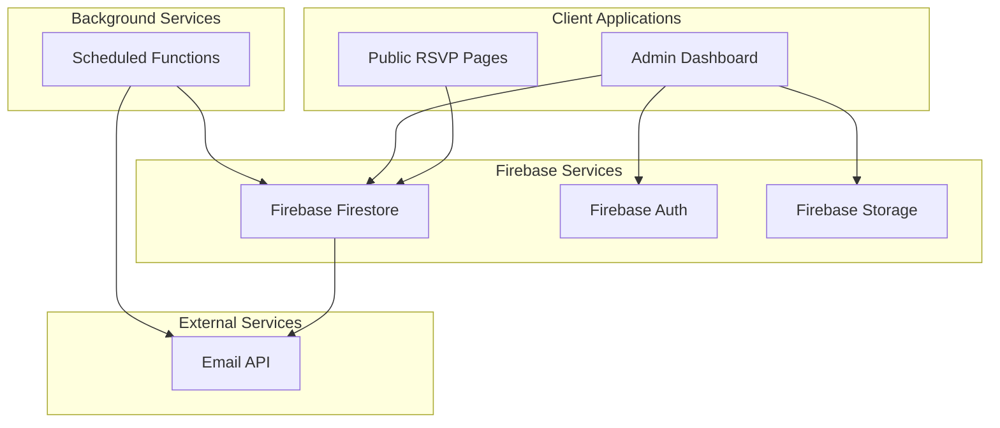

# Design Document

## Overview

The multi-event dashboard system transforms the existing single-event RSVP prototype into a comprehensive event management platform. The architecture maintains the current React/Firebase foundation while adding Google Authentication, multi-tenancy support, email notifications, and administrative capabilities. The design preserves the existing purple/yellow aesthetic and user experience patterns while extending functionality for event organizers.

## Architecture

### High-Level Architecture



### Application Structure

The application will be restructured to support multiple routes and authentication:

```
src/
├── components/
│   ├── common/           # Shared UI components
│   ├── rsvp/            # RSVP-specific components
│   ├── dashboard/       # Dashboard-specific components
│   └── games/           # Game components
├── pages/
│   ├── RsvpPage.tsx     # Public RSVP page
│   ├── DashboardPage.tsx # Admin dashboard
│   └── LoginPage.tsx    # Authentication page
├── services/
│   ├── auth.ts          # Authentication logic
│   ├── events.ts        # Event management
│   ├── rsvps.ts         # RSVP operations
│   └── email.ts         # Email notifications
├── hooks/               # Custom React hooks
├── types/               # TypeScript definitions
└── utils/               # Utility functions
```

## Components and Interfaces

### Data Models

#### Event Model
```typescript
interface Event {
  id: string;
  title: string;
  description?: string;
  datetime: Date;
  createdBy: string; // User email
  createdAt: Date;
  updatedAt: Date;
  logoUrl?: string;
  gameType: GameType;
  isActive: boolean;
}

enum GameType {
  RAINBOW_HOP = 'rainbow_hop',
  // Future game types can be added here
}
```

#### Enhanced RSVP Model
```typescript
interface RsvpData {
  id?: string;
  eventId: string;
  name: string;
  email: string;
  connectionMethod: ConnectionMethod;
  submittedAt: Date;
  reminderSent?: boolean;
}
```

#### User Model
```typescript
interface User {
  uid: string;
  email: string;
  displayName?: string;
  photoURL?: string;
  domain: string;
  lastLogin: Date;
}
```

### Authentication Service

```typescript
interface AuthService {
  signInWithGoogle(): Promise<User>;
  signOut(): Promise<void>;
  getCurrentUser(): User | null;
  isAuthorized(user: User): boolean;
  onAuthStateChanged(callback: (user: User | null) => void): () => void;
}
```

### Event Management Service

```typescript
interface EventService {
  createEvent(event: Omit<Event, 'id' | 'createdAt' | 'updatedAt'>): Promise<Event>;
  getEventsByUser(userEmail: string): Promise<Event[]>;
  getEventById(id: string): Promise<Event | null>;
  updateEvent(id: string, updates: Partial<Event>): Promise<void>;
  deleteEvent(id: string): Promise<void>;
  uploadEventLogo(file: File): Promise<string>;
}
```

### RSVP Service

```typescript
interface RsvpService {
  submitRsvp(rsvp: Omit<RsvpData, 'id' | 'submittedAt'>): Promise<void>;
  getRsvpsByEvent(eventId: string): Promise<RsvpData[]>;
  getRsvpsByEmail(email: string): Promise<RsvpData[]>;
}
```

### Email Service

```typescript
interface EmailService {
  sendRsvpConfirmation(rsvp: RsvpData, event: Event): Promise<void>;
  sendOrganizerNotification(rsvp: RsvpData, event: Event): Promise<void>;
  sendEventReminder(recipients: string[], event: Event): Promise<void>;
}

interface EmailPayload {
  to: string[];
  subject: string;
  html: string;
  from?: string;
}
```

## Data Models

### Database Collections

#### Events Collection (`events`)
```json
{
  "id": "auto-generated",
  "title": "Weekly Prototype Session",
  "description": "Join us for our weekly prototype session",
  "datetime": "2025-02-15T18:00:00Z",
  "createdBy": "organizer@sodaworld.tv",
  "createdAt": "2025-01-15T10:00:00Z",
  "updatedAt": "2025-01-15T10:00:00Z",
  "logoUrl": "https://storage.googleapis.com/bucket/logo.png",
  "gameType": "rainbow_hop",
  "isActive": true
}
```

#### RSVPs Collection (`rsvps`)
```json
{
  "id": "auto-generated",
  "eventId": "event-id-reference",
  "name": "John Doe",
  "email": "john@example.com",
  "connectionMethod": "VR",
  "submittedAt": "2025-01-20T14:30:00Z",
  "reminderSent": false
}
```

#### Users Collection (`users`)
```json
{
  "uid": "firebase-auth-uid",
  "email": "user@sodaworld.tv",
  "displayName": "User Name",
  "photoURL": "https://avatar-url.com",
  "domain": "sodaworld.tv",
  "lastLogin": "2025-01-20T09:00:00Z"
}
```

### Database Indexes

For optimal query performance:
- `events`: Compound index on `(createdBy, isActive, datetime)`
- `rsvps`: Compound index on `(eventId, submittedAt)`
- `rsvps`: Single index on `email` for user lookup

## Error Handling

### Authentication Errors
- **Unauthorized Domain**: Display friendly message with contact information
- **Authentication Failure**: Provide retry mechanism and fallback options
- **Session Expiry**: Automatic redirect to login with return URL preservation

### Database Errors
- **Connection Issues**: Implement retry logic with exponential backoff
- **Permission Denied**: Clear error messages with suggested actions
- **Data Validation**: Client-side validation with server-side verification

### Email Service Errors
- **API Unavailable**: Log error, continue RSVP processing, queue for retry
- **Invalid Recipients**: Validate email addresses before sending
- **Rate Limiting**: Implement queuing system for bulk operations

### File Upload Errors
- **File Size Limits**: 5MB maximum with clear user feedback
- **Invalid File Types**: Whitelist PNG, JPG, JPEG, GIF with validation
- **Storage Quota**: Graceful degradation with default images

## Testing Strategy

### Unit Testing
- **Services**: Mock Firebase dependencies, test business logic
- **Components**: React Testing Library for UI interactions
- **Utilities**: Pure function testing with edge cases
- **Hooks**: Custom hook testing with React Hooks Testing Library

### Integration Testing
- **Authentication Flow**: End-to-end login/logout scenarios
- **RSVP Submission**: Complete form submission with database verification
- **Email Notifications**: Mock external API, verify payload structure
- **File Uploads**: Test upload flow with various file types

### End-to-End Testing
- **User Journeys**: Complete workflows from login to event creation to RSVP
- **Cross-Browser**: Ensure compatibility across modern browsers
- **Mobile Responsiveness**: Test on various device sizes
- **Performance**: Load testing with multiple concurrent users

### Security Testing
- **Authentication**: Verify domain restrictions and session management
- **Authorization**: Test access controls for event management
- **Input Validation**: SQL injection and XSS prevention
- **File Upload Security**: Malicious file detection and sanitization

## Implementation Phases

### Phase 1: Core Infrastructure
- Database schema migration
- Authentication setup
- Basic routing structure
- Domain restriction implementation

### Phase 2: Event Management
- Event creation and editing
- File upload functionality
- Event listing and management
- Basic dashboard UI

### Phase 3: Enhanced RSVP System
- Event-specific RSVP pages
- Updated RSVP form with event association
- Game configuration integration
- Rainbow Hop bug fixes

### Phase 4: Email Integration
- Email service implementation
- RSVP confirmation emails
- Organizer notifications
- Reminder system setup

### Phase 5: Polish and Optimization
- UI/UX refinements
- Performance optimizations
- Comprehensive testing
- Documentation and deployment

## Security Considerations

### Authentication Security
- Google OAuth 2.0 implementation
- Domain-based access control
- Secure session management
- CSRF protection

### Data Security
- Firebase Security Rules for collection access
- Input sanitization and validation
- Secure file upload handling
- PII protection in logs

### API Security
- Rate limiting for email API calls
- Secure credential management
- HTTPS enforcement
- Error message sanitization

## Performance Considerations

### Client-Side Optimization
- Code splitting by route
- Lazy loading of dashboard components
- Image optimization and caching
- Bundle size monitoring

### Database Optimization
- Efficient query patterns
- Proper indexing strategy
- Pagination for large datasets
- Connection pooling

### Caching Strategy
- Browser caching for static assets
- Firebase caching for frequently accessed data
- CDN for uploaded images
- Service worker for offline capability